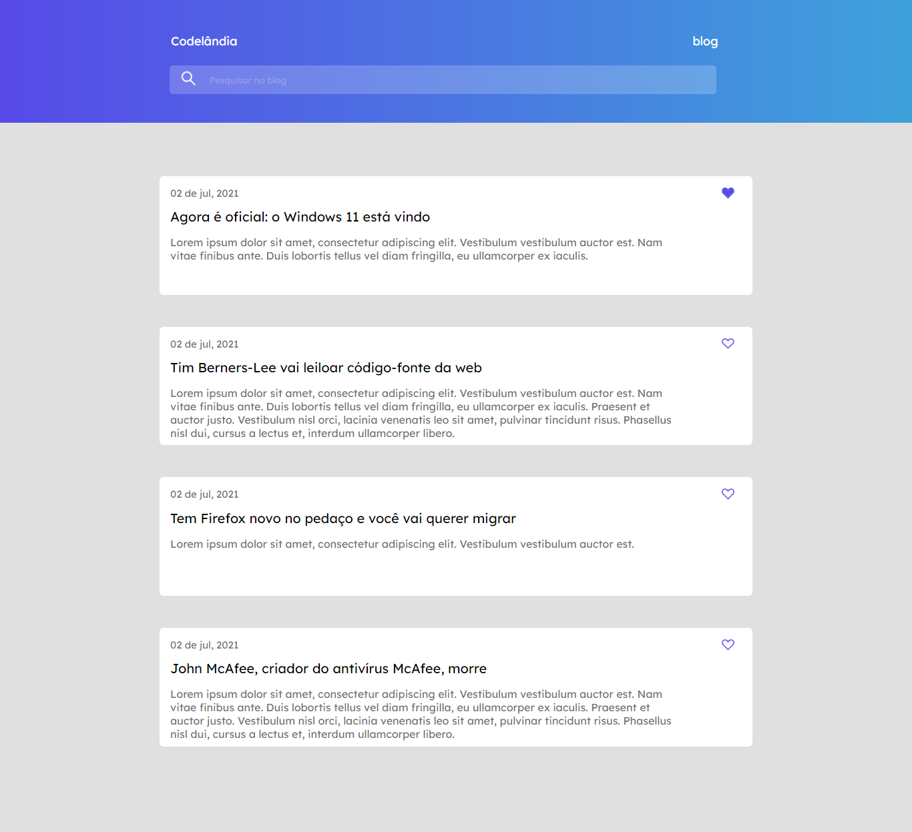

<h1 align="center">
  💻📖 Blog codelândia
</h1>

Essa é uma projeto de uma página desenvolvida pelo dev [**Iuri**](https://github.com/iuricode) à comunidade *Codelândia*. Com o objetivo de replicar através do [Figma](https://www.figma.com/file/Yb9IBH56g7T1hdIyZ3BMNO/Desafios---Codel%C3%A2ndia?type=design&node-id=139-51&mode=design&t=RnK3GDEBk565dj7w-0) uma página dedicada ao projeto de um blog. Este README.md fornecerá uma visão geral do blog e suas notícias, podendo favoritar.

---

---

## Para o desenvolvimento deste site utilizei as seguintes tecnologias:
- HTML
- CSS
- Adobe xd
- GIT e Github

Para o desenvolvimento da página houve alguns desafios, dentre eles posso citar: a utilização  da propriedade `display flex`, manipulação das imagens e ícones, bem  como tornar a página responsiva.

---
